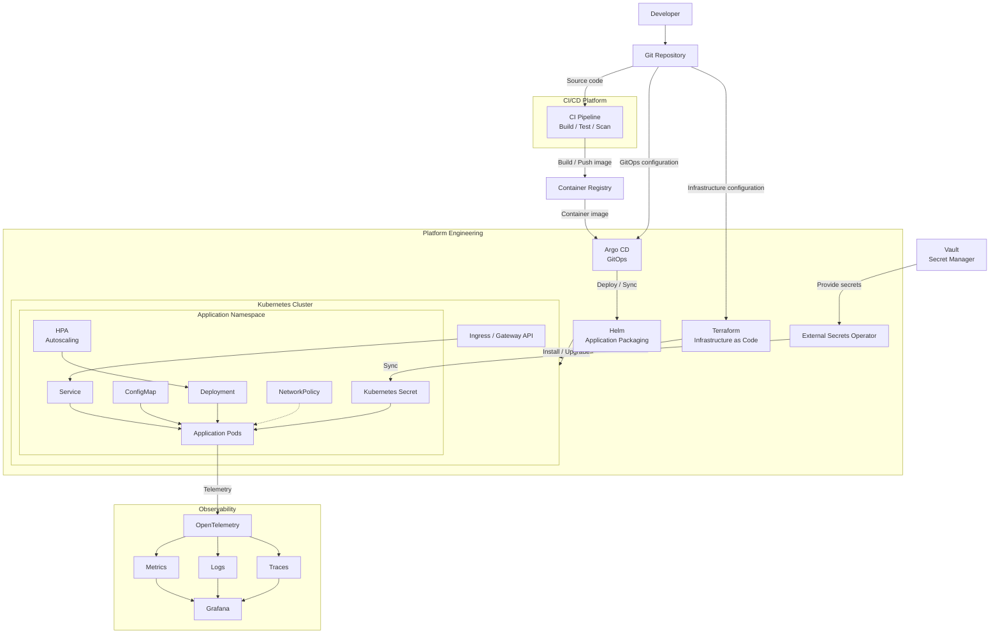

# Platform Engineering Lab

A hands-on platform engineering learning journey using local infrastructure to explore Kubernetes, Infrastructure as Code (IaC), GitOps, observability, networking, security, and CI/CD.

The goal is to build practical platform engineering skills through progressively more advanced labs, starting with a local Kubernetes cluster and eventually simulating production-like platform workflows.

## Target Architecture

This diagram represents the target architecture for the complete learning project.
Components are introduced progressively throughout each phase.



## Learning Path

| Phase | Topic                   | Main Components                                    |
| ----- | ----------------------- | -------------------------------------------------- |
| 01    | Kubernetes Fundamentals | Pod, Deployment, Service, ConfigMap, Secret        |
| 02    | Kustomize               | Base, Overlay, Environment                         |
| 03    | Kubernetes Operations   | Probes, Resources, Rollout, Troubleshooting        |
| 04    | Terraform + Kubernetes  | Terraform, Provider, ConfigMap, Secret, Vault, ESO |
| 05    | Helm                    | Helm Charts, Templates, Values                     |
| 06    | GitOps                  | Argo CD                                            |
| 07    | CI/CD                   | Build, Test, Scan, Registry                        |
| 08    | Observability           | OpenTelemetry, Metrics, Logs, Traces, Grafana      |
| 09    | Security                | RBAC, NetworkPolicy, Image Security, Secrets       |
| 10    | Networking              | Ingress, Gateway API, DNS                          |
| 11    | Production Kubernetes   | HPA, HA, Backup, Upgrades                          |
| 12    | Platform Engineering    | Combine everything into one platform               |

---

## Learning Goals

- Understand Kubernetes architecture and workload management.
- Learn Infrastructure as Code (IaC) principles.
- Build reproducible local infrastructure.
- Manage Kubernetes configurations across environments.
- Implement GitOps workflows.
- Explore cloud-native networking and observability.
- Practice CI/CD, platform automation, and security.
- Develop production-oriented platform engineering skills.

---

## Repository Structure

```text
platform-engineering-lab/
├── README.md
├── phase-01-kubernetes/
├── phase-02-kustomize/
├── phase-03-terraform/
├── phase-04-helm/
├── phase-05-gitops/
├── phase-06-networking/
├── phase-07-observability/
├── phase-08-cicd-devsecops/
├── phase-09-platform-engineering/
└── phase-10-production-architecture/
```

---

## Local Environment

Recommended baseline:

- Linux
- Docker
- Kind
- kubectl
- Git
- GitHub account

Additional tools will be introduced progressively in each phase.

---

## Learning Approach

Each phase follows this workflow:

1. Understand the concept.
2. Build it manually.
3. Inspect what Kubernetes or the infrastructure is doing.
4. Automate the configuration.
5. Introduce failure scenarios.
6. Troubleshoot and document the results.

The emphasis is on understanding **why** a tool is used, not just memorizing commands.

---
