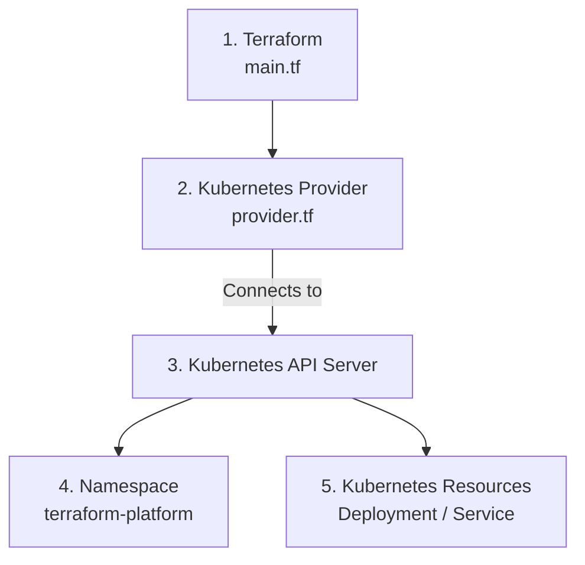

# Kubernetes Provider

## Architecture



## Files

| Step | Component               | File          |
| ---- | ----------------------- | ------------- |
| 1    | Terraform configuration | `main.tf`     |
| 2    | Kubernetes Provider     | `provider.tf` |
| 3    | Kubernetes API Server   | Kubernetes    |
| 4    | Namespace               | `main.tf`     |
| 5    | Kubernetes resources    | `main.tf`     |

## Provider Configuration

Terraform uses the Kubernetes provider to communicate with the Kubernetes cluster.

```hcl
provider "kubernetes" {
  config_path = "~/.kube/config"
}
```

The provider reads the Kubernetes configuration from `~/.kube/config` and uses it to connect to the cluster.

## Resources

Terraform manages the following Kubernetes resources:

- Namespace
- Deployment
- Service
