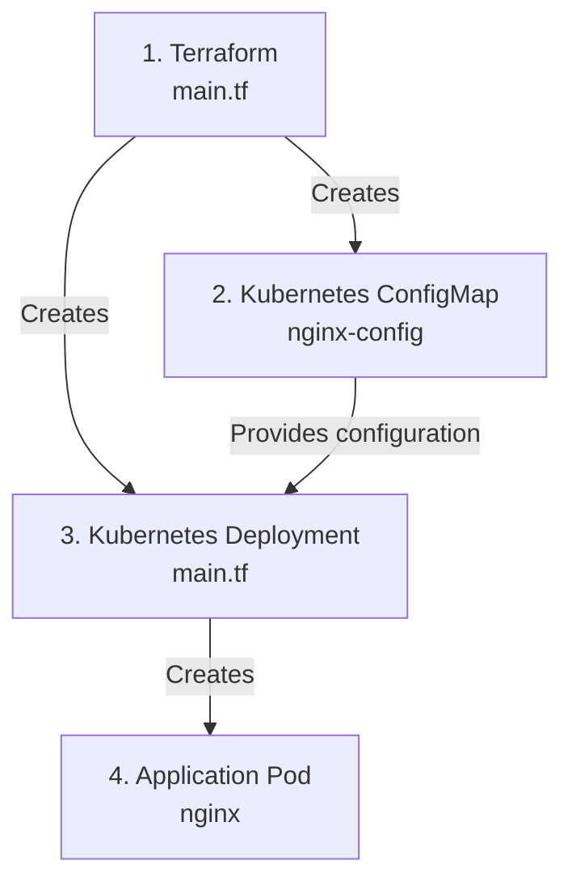

# ConfigMap Management

## Architecture



## Files

| Step | Component               | File                  |
| ---- | ----------------------- | --------------------- |
| 1    | Terraform configuration | `main.tf`             |
| 2    | ConfigMap               | `main.tf`             |
| 3    | Deployment              | `main.tf`             |
| 4    | Application Pod         | Created by Kubernetes |

## Configuration Flow

Terraform creates the ConfigMap and Deployment.

The Deployment references the ConfigMap using `env_from`.

## Rollout Trigger

The Deployment uses a checksum annotation:

```hcl
"config-checksum" = sha256(jsonencode(kubernetes_config_map.nginx.data))
```

When the ConfigMap changes, the checksum changes.

This changes the Pod template and causes Kubernetes to perform a rolling update.
