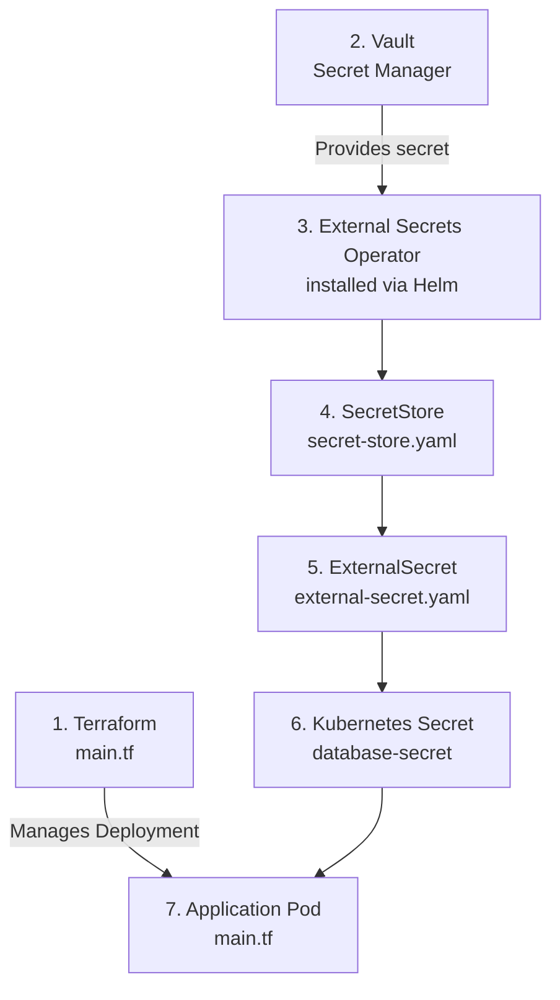

# Secret Management

## Architecture

## Why?

Terraform should manage infrastructure, while a dedicated secret manager such as Vault manages sensitive values.

This avoids putting actual secret values directly in Terraform configuration.
