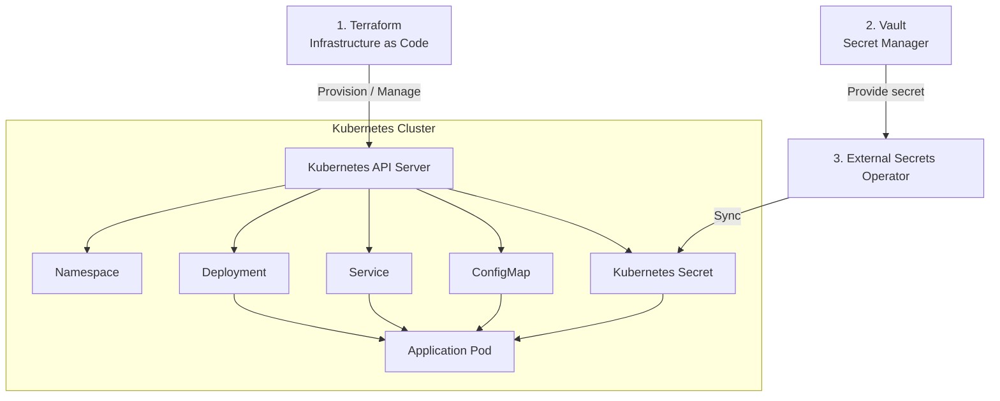

# Phase 4 - Terraform + Kubernetes

## Overview

This phase introduces Terraform for managing Kubernetes resources.

The goal is to understand how Terraform interacts with Kubernetes, how Terraform state tracks infrastructure, how configuration is managed with ConfigMaps, and how sensitive values can be managed using an external secret manager.

## Architecture

## Topics

| Step | Topic                | Directory      |
| ---- | -------------------- | -------------- |
| 1    | Kubernetes Provider  | `01-provider/` |
| 2    | ConfigMap Management | `02-config/`   |
| 3    | Secret Management    | `03-secret/`   |

## What I Learned

### Terraform + Kubernetes

Terraform can use the Kubernetes provider to create and manage Kubernetes resources through the Kubernetes API.

The provider uses the Kubernetes configuration to authenticate and connect to the cluster.

### Infrastructure State

Terraform maintains state to track the resources it manages.

This allows Terraform to:

- Detect configuration changes
- Detect infrastructure drift
- Reconcile the desired state with the actual state

### Configuration Management

Kubernetes ConfigMaps can be used to provide non-sensitive configuration to applications.

A checksum annotation can be used to trigger a Deployment rollout when the ConfigMap changes.

### Secret Management

Kubernetes Secrets are intended for sensitive configuration, but storing secret values directly in Terraform can expose them through Terraform state.

This phase introduces **Vault + External Secrets Operator (ESO)** as an external secret management approach.

Vault stores the actual secret values, while ESO synchronizes them into a Kubernetes Secret that can be consumed by the application.

## Key Concepts

- Terraform Provider
- Terraform State
- Infrastructure Drift
- Kubernetes Deployment
- Kubernetes Service
- ConfigMap
- Kubernetes Secret
- External Secrets Operator
- Vault
- SecretStore
- ExternalSecret
