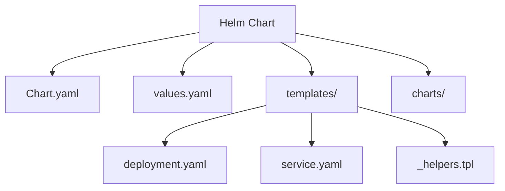
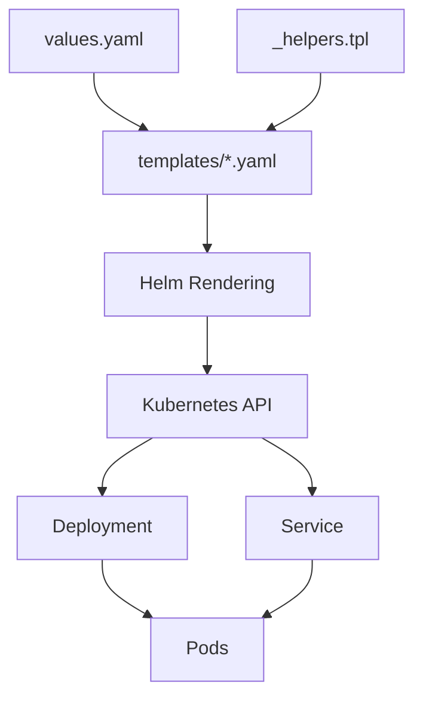

# 01 — Helm Chart

Learn the basic structure and lifecycle of a Helm Chart.

## Architecture

### Chart Structure



### Deployment Flow



## What We Learned

- Chart.yaml
- values.yaml
- templates/
- \_helpers.tpl
- `.Values`
- `.Chart`
- `.Release`
- `helm template`
- `helm install`
- `helm upgrade`
- Helm releases and revisions

## Chart Structure

```text
nginx/
├── Chart.yaml
├── values.yaml
├── values-dev.yaml
├── values-prod.yaml
├── charts/
└── templates/
    ├── deployment.yaml
    ├── service.yaml
    ├── serviceaccount.yaml
    ├── ingress.yaml
    ├── hpa.yaml
    ├── httproute.yaml
    ├── _helpers.tpl
    └── tests/
```

## Result

Created and deployed an nginx Helm Chart to the `platform` namespace.

```bash
helm list -n platform
```

The Helm release is:

```text
Release:  nginx
Namespace: platform
```
