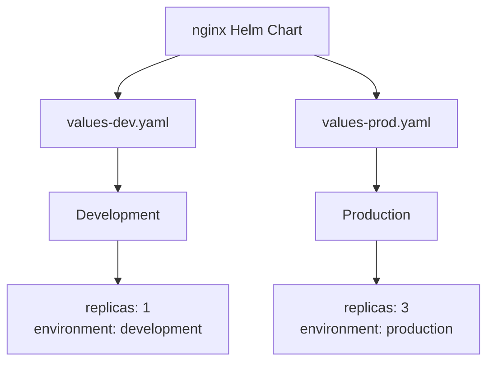
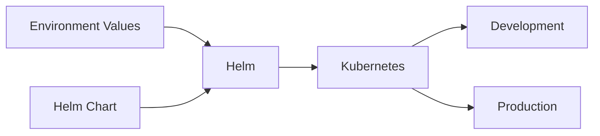
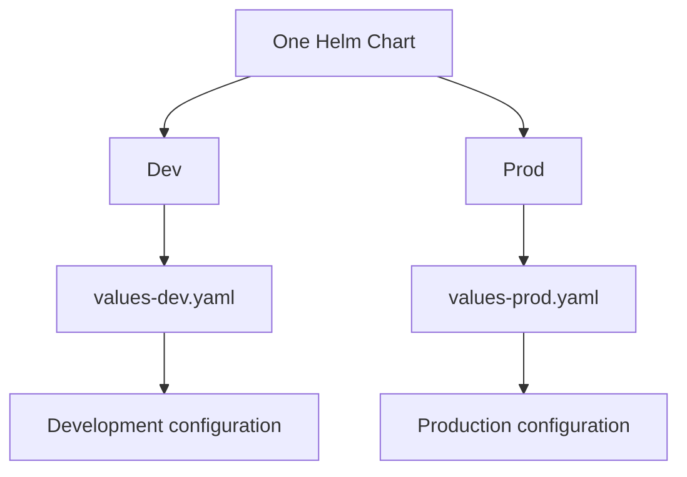

# Helm Environments

This phase demonstrates how to use the same Helm chart with different environment configurations.

## Goals

- Manage environment-specific configuration with Helm values.
- Deploy the same chart to different environments.
- Understand values file overrides.
- Practice `helm upgrade` with different environment values.

## Structure

```text
04-environments/
├── README.md
└── nginx/
    ├── Chart.yaml
    ├── values.yaml
    ├── values-dev.yaml
    ├── values-prod.yaml
    └── templates/
```

## Environment configuration

The same Helm chart is reused across environments.



## Deployment flow



## Commands

Render development configuration:

```bash
helm template nginx ./nginx -f ./nginx/values-dev.yaml
```

Render production configuration:

```bash
helm template nginx ./nginx -f ./nginx/values-prod.yaml
```

Deploy development:

```bash
helm upgrade --install nginx ./nginx \
  -n platform \
  -f ./nginx/values-dev.yaml
```

Deploy production:

```bash
helm upgrade --install nginx ./nginx \
  -n platform \
  -f ./nginx/values-prod.yaml
```

## Key concept

One Helm chart can be reused across multiple environments.



The templates remain the same. Only the environment specific values change.
