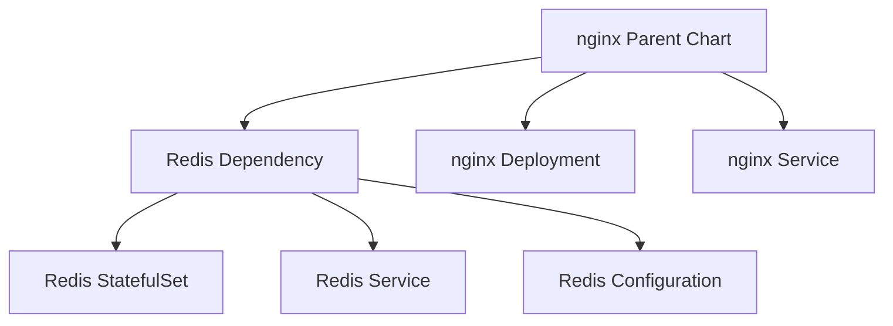

# Helm Dependencies

This phase demonstrates how a Helm chart can depend on another Helm chart.

In this example, the `nginx` chart depends on the Bitnami Redis chart.

## Structure

```text
05-dependencies/
├── README.md
└── nginx/
    ├── Chart.yaml
    ├── values.yaml
    ├── values-dev.yaml
    ├── values-prod.yaml
    ├── templates/
    └── charts/
        └── redis-28.2.3.tgz
```

## Dependency configuration

The Redis dependency is declared in `Chart.yaml`:

```yaml
dependencies:
  - name: redis
    version: "28.2.3"
    repository: "https://charts.bitnami.com/bitnami"
```

Download the dependency:

```bash
helm dependency update
```

Verify:

```bash
helm dependency list .
```

## Configure the dependency

The parent chart can configure Redis through the `redis` values key:

```yaml
redis:
  architecture: standalone
  auth:
    enabled: false
```

The values are passed to the Redis subchart.

Conceptually:

```text
nginx parent chart
        │
        └── redis dependency
                │
                ├── architecture
                └── auth
```

## Render the dependency

Render the complete parent chart:

```bash
helm template nginx .
```

The output contains resources from both:

- nginx
- Redis

For example, Redis renders a StatefulSet:

```text
nginx-redis-master
```

## Install

Create a test namespace:

```bash
kubectl create namespace helm-deps
```

Install the parent chart:

```bash
helm upgrade --install nginx . -n helm-deps
```

Verify:

```bash
kubectl get pods -n helm-deps
```

Expected resources include:

```text
nginx-xxxxxxxxxx-xxxxx
nginx-redis-master-0
```

## Kind image loading

When using a local Kind cluster, the Kind node may not be able to pull images directly from the registry.

If Redis reports `ErrImagePull` or `ImagePullBackOff`:

```bash
docker pull bitnami/redis:latest
```

Then load the image into the Kind cluster:

```bash
kind load docker-image bitnami/redis:latest --name platform-lab
```

Check the Pod again:

```bash
kubectl get pods -n helm-deps
```

## Key concepts

### Parent chart

The `nginx` chart is the parent chart.

### Subchart

Redis is a subchart/dependency of the nginx chart.

### Dependency update

`helm dependency update` downloads the dependency package into:

```text
charts/
```

### Scoped values

Parent chart values for a dependency are scoped by the dependency name:

```yaml
redis:
  architecture: standalone
```

This allows the parent chart to configure the Redis subchart without modifying Redis itself.

## Architecture



## Cleanup

After testing:

```bash
helm uninstall nginx -n helm-deps
kubectl delete namespace helm-deps
```

## What I learned

- Helm charts can have dependencies.
- Dependencies are declared in `Chart.yaml`.
- `helm dependency update` downloads dependency charts.
- Dependency charts are stored under `charts/`.
- Parent charts can configure subcharts through scoped values.
- A parent chart renders resources from its dependencies.
- Kind may require locally loading container images when registry access fails.
