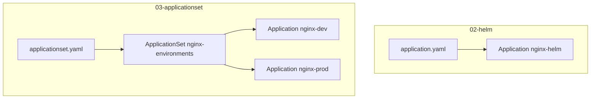

# Argo CD ApplicationSet

This step demonstrates how a single `ApplicationSet` generates multiple Argo CD `Application` resources from one template.

Instead of writing one `Application` per environment, one `ApplicationSet` generates:

- `nginx-dev`
- `nginx-prod`

Both use the same Helm chart from phase 05 (`phase-05-helm/04-environments/nginx`) with different values files.

## Goals

- Understand the `ApplicationSet` CRD.
- Generate Applications from a template with a list generator.
- Deploy the same chart to multiple namespaces from one file.
- Understand `{{env}}` templating in `metadata.name`, `valueFiles` and `destination.namespace`.

## Structure

```text
03-applicationset/
├── README.md
└── applicationset.yaml
```

## Application vs ApplicationSet



An `Application` describes one deployment. An `ApplicationSet` describes how to generate Applications.

## The generator

The generator produces the parameters used by the template:

```yaml
generators:
  - list:
      elements:
        - env: dev
        - env: prod
```

Each element is one set of template parameters. `env` is the parameter name used in the template.

## The template

Every `{{env}}` placeholder is replaced with the value from the generator:

```yaml
metadata:
  name: 'nginx-{{env}}'
...
helm:
  valueFiles:
    - values.yaml
    - values-{{env}}.yaml
...
destination:
  namespace: nginx-{{env}}
```

Rendered by the controller:

```text
env: dev   ->  Application nginx-dev   values.yaml + values-dev.yaml   namespace nginx-dev
env: prod  ->  Application nginx-prod  values.yaml + values-prod.yaml  namespace nginx-prod
```

## Apply

```bash
kubectl apply -f phase-06-argocd/03-applicationset/applicationset.yaml
```

Argo CD detects the new `ApplicationSet` and creates the generated Applications.

## Verify

```bash
kubectl get applicationsets -n argocd
kubectl get applications -n argocd
```

Expected:

```text
NAME                 AGE
nginx-environments   1m

NAME          SYNC STATUS   HEALTH STATUS
gitops-demo   Synced        Healthy
nginx-dev     Synced        Healthy
nginx-helm    Synced        Healthy
nginx-prod    Synced        Healthy
```

Check the generated resources:

```bash
kubectl get pods -n nginx-dev
kubectl get pods -n nginx-prod
```

Expected:

```text
nginx-dev   -> 1 replica  (values-dev.yaml,  environment: development)
nginx-prod  -> 3 replicas (values-prod.yaml, environment: production)
```

```bash
kubectl get deploy -n nginx-dev
kubectl get deploy -n nginx-prod
```

Generated Applications can be filtered by the label the ApplicationSet controller adds:

```bash
kubectl get applications -n argocd -l argocd.argoproj.io/application-set-name=nginx-environments
```

## Validation

Render what the controller will create without touching the cluster:

```bash
kubectl apply --dry-run=server -f phase-06-argocd/03-applicationset/applicationset.yaml
```

## Key concepts

### Generator

The generator supplies the parameters. Other generators exist as well:

- `list` — static values, used here.
- `git` — read directories/files from a repository (one Application per environment folder).
- `clusters` — one Application per registered cluster.
- `matrix` / `merge` — combine multiple generators.

### Template

The template is a normal `Application` with placeholders. Everything that differs per environment is templated.

### Ownership

Applications generated by an `ApplicationSet` are owned by it. They are labeled with `argocd.argoproj.io/application-set-name` and are deleted when the `ApplicationSet` is deleted.

Deleting the `ApplicationSet` therefore removes `nginx-dev` and `nginx-prod` (and, with `prune: true`, their resources).

### Helm values per environment

Argo CD merges the values files in order, so `values-{{env}}.yaml` (the later file) overrides `values.yaml` (the earlier one).

The Helm release name defaults to the Application name, so the releases are `nginx-dev` and `nginx-prod` — one release per namespace, no collision with `nginx-helm` from `02-helm`.

## Cleanup

```bash
kubectl delete -f phase-06-argocd/03-applicationset/applicationset.yaml
kubectl delete namespace nginx-dev nginx-prod
```

## What I learned

- `ApplicationSet` is a CRD that generates `Application` CRs.
- A generator produces the parameters, the template consumes them.
- One file can manage the same chart across many environments.
- `{{env}}` templating works in names, values file names and namespaces.
- `CreateNamespace=true` still creates the target namespaces.
- Generated Applications are owned and labeled by the `ApplicationSet`.
- Deleting the `ApplicationSet` deletes its generated Applications.
- The default fasttemplate syntax (`{{env}}`) can be replaced by Go templates (`{{ .env }}`) with `goTemplate: true` for more advanced templating.
