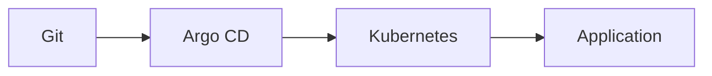
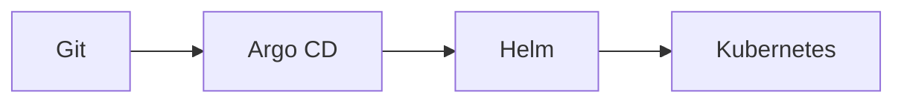

# Phase 06 — Argo CD & GitOps

Learn GitOps using Argo CD with Kubernetes and Helm.

## Structure

```text
phase-06-argocd/
├── 01-gitops/
│   ├── namespace.yaml
│   ├── deployment.yaml
│   └── service.yaml
│
├── 02-helm/
│   └── application.yaml
│
└── README.md
```

## What We Learned

- Install Argo CD
- Argo CD Web UI
- Argo CD `Application`
- GitOps workflow
- Automated sync
- Manual sync
- `selfHeal`
- `prune`
- Helm with Argo CD
- Helm values per environment
- Kubernetes CRD
- ApplicationSet CRD

## GitOps Flow



## Helm Flow



## Verification

```bash
kubectl get pods -n argocd
kubectl get applications -n argocd
kubectl get crd applicationsets.argoproj.io
```

Expected:

```text
gitops-demo   Synced   Healthy
nginx-helm    Synced   Healthy
```
